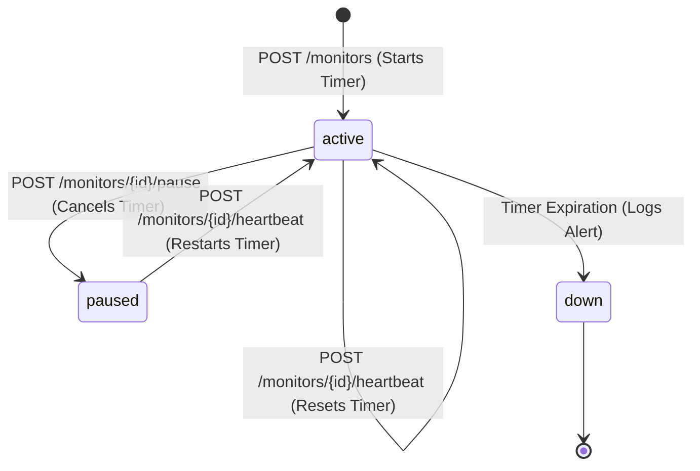
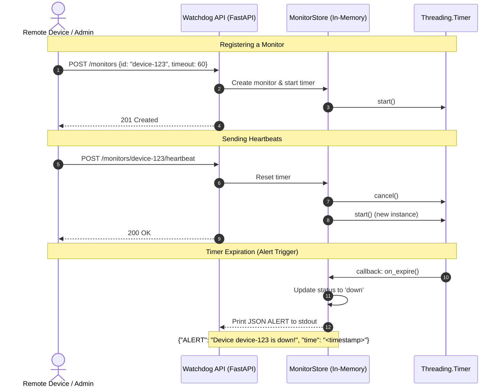

# Pulse-Check API ("Watchdog" Sentinel)

A robust, thread-safe **Dead Man's Switch API** designed for critical infrastructure monitoring (e.g., remote solar farms and unmanned weather stations). Devices register a watchdog monitor with a countdown timer. If a device fails to ping the server before its timer expires, the API automatically logs a critical alert and changes the device's status to `down`.

---

## 1. System Architecture

The watchdog system operates as a stateful timer service. Operations are thread-safe, utilizing lock synchronization to coordinate background timeout threads and web worker processes.

### State Transition Diagram


### Sequence Flow Diagram


---

## 2. Setup & Installation

### Prerequisites
- Python 3.11 or higher
- pip (Python Package Installer)

### Installation
1. Clone your forked repository:
   ```bash
   git clone https://github.com/ishimwebrian/Pulse-Check.git
   cd Pulse-Check
   ```

2. Install dependencies:
   ```bash
   pip install -r requirements.txt
   ```

### Running the Server
Start the FastAPI server locally using Uvicorn:
```bash
uvicorn app:app --reload
```
Once started, the interactive API documentation (Swagger UI) is available at:
- http://127.0.0.1:8000/docs

### Running the Test Suite
We have included a full automated test suite covering all state transitions, edge cases, and timeouts. Run the tests using:
```bash
python -m pytest
```

---

## 3. API Documentation

### 0. Watchdog Control Dashboard (Premium iOS UI)
- **Endpoint**: `GET /`
- **Description**: Serves the interactive, real-time web control panel (iOS 26 glassmorphism style) for managing and presenting monitors.
- **Usage**: Open `http://127.0.0.1:8000/` in a web browser.

### 1. Register a Monitor
- **Endpoint**: `POST /monitors`
- **Description**: Registers a new device monitor and starts a countdown timer.
- **Request Body**:
  ```json
  {
    "id": "device-123",
    "timeout": 60,
    "alert_email": "admin@critmon.com"
  }
  ```
- **Response** (`201 Created`):
  ```json
  {
    "message": "Monitor registered successfully",
    "monitor": {
      "id": "device-123",
      "timeout": 60,
      "alert_email": "admin@critmon.com",
      "status": "active"
    }
  }
  ```
- **Example request**:
  ```bash
  curl -X POST "http://127.0.0.1:8000/monitors" \
       -H "Content-Type: application/json" \
       -d '{"id": "device-123", "timeout": 60, "alert_email": "admin@critmon.com"}'
  ```

### 2. Device Heartbeat (Reset)
- **Endpoint**: `POST /monitors/{id}/heartbeat`
- **Description**: Resets the countdown timer for the specified device and unpauses it if it was paused.
- **Response** (`200 OK`):
  ```json
  {
    "message": "Heartbeat received, timer reset",
    "status": "active"
  }
  ```
- **Error Responses**:
  - `404 Not Found` if the monitor ID is not registered.
  - `400 Bad Request` if the monitor has already expired (status is `down`).
- **Example request**:
  ```bash
  curl -X POST "http://127.0.0.1:8000/monitors/device-123/heartbeat"
  ```

### 3. Pause Countdown
- **Endpoint**: `POST /monitors/{id}/pause`
- **Description**: Pauses monitoring (cancels the timer) for maintenance. No alerts will fire.
- **Response** (`200 OK`):
  ```json
  {
    "message": "Monitor paused successfully",
    "status": "paused"
  }
  ```
- **Error Responses**:
  - `404 Not Found` if the monitor ID is not registered.
  - `400 Bad Request` if the monitor has already expired (status is `down`).
- **Example request**:
  ```bash
  curl -X POST "http://127.0.0.1:8000/monitors/device-123/pause"
  ```

### 4. List All Monitors (Developer's Choice)
- **Endpoint**: `GET /monitors`
- **Description**: Retrieves a list of all registered monitors, showing status, total pings, and remaining countdown seconds.
- **Response** (`200 OK`):
  ```json
  [
    {
      "id": "device-123",
      "timeout": 60,
      "alert_email": "admin@critmon.com",
      "status": "active",
      "last_heartbeat": "2026-07-11T00:25:00.123456+00:00",
      "heartbeat_count": 5,
      "remaining_seconds": 45.2
    }
  ]
  ```
- **Example request**:
  ```bash
  curl -X GET "http://127.0.0.1:8000/monitors"
  ```

### 5. Unregister/Delete a Monitor (Developer's Choice)
- **Endpoint**: `DELETE /monitors/{id}`
- **Description**: Completely deletes a monitor and cancels any active timer.
- **Response** (`200 OK`):
  ```json
  {
    "message": "Monitor with ID 'device-123' deleted successfully"
  }
  ```
- **Example request**:
  ```bash
  curl -X DELETE "http://127.0.0.1:8000/monitors/device-123"
  ```

---

## 4. The Developer's Choice: Enhanced Observability & Lifecycle Controls

To make this watchdog sentinel robust enough for real-world production monitoring, we went beyond the basic requirements to implement:

1. **`GET /monitors` (Enhanced Observability)**:
   - **Why**: Devices in areas with spotty connection can experience high jitter. Administrators need to verify if devices are about to time out, how many heartbeats have been successfully registered (`heartbeat_count`), and exact time left (`remaining_seconds`).
   - **How**: This endpoint calculates the time elapsed since the last heartbeat and returns `remaining_seconds` in real-time.

2. **`DELETE /monitors/{id}` (Lifecycle Cleanup)**:
   - **Why**: Solar farms get decommissioned, and weather stations get replaced. Without a delete endpoint, active timers for removed devices would run, consume resources, and eventually fire false alarms.
   - **How**: Deleting a device safely cancels the background thread timer and cleans up the memory dict.
